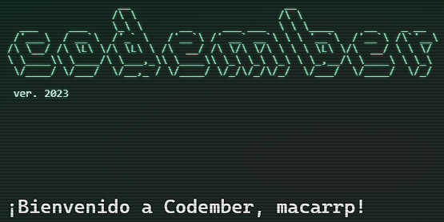

## Estructura
Cada reto está separado en su propia carpeta. Dentro de cada uno de ellos encontrarás
- La solución del reto programada en Java 
- Un fichero de texto con la información a procesar.
- Un archivo MD con el enunciado del problema 